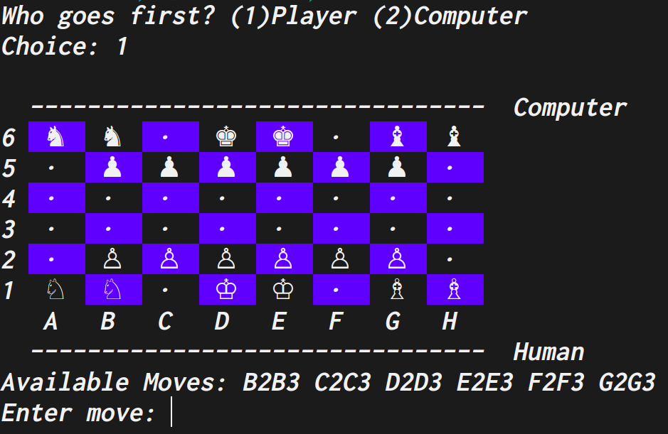

# Congress Chess

- "Congress Chess" is a brand new chess-like board game designed just for students
  of CSc-180, in which the chessboard is inspired by our Congress. There is a
  "right-wing" (featuring clergy), and a "left-wing" (featuring the environment).
  And there are "junior" and "senior" politicians.

## The Game

- "Congress Chess" is a chess-like game in which each player takes turns moving one
  of his/her pieces. The board is 8x6, with the left four columns being the "left wing"
  and the right four columns being the "right wing".
- Each player has TWO Kings, one in each wing. Each player also has 6 pawns, and
  4 politicians. If a politician is in the "left" wing, it becomes a HORSE.
  If a politician is in the "right" wing, it becomes a BISHOP. Thus, a politician
  changes if it moves from one wing to another. Also, a politician that is in the
  first three rows (nearest its own kings) is a "junior". A politician that is in
  the furthest three rows is a "senior". Specific rules about how each type of
  piece can move is described later.
- Players alternate moves, moving one of their own pieces each turn.
  When it is your turn, you MUST make a move -- you cannot pass.
- the initial position is:
  

## Bishop

- moves roughly the same as the "bishop" in regular chess.
  That is, in a diagonal line any number of squares.
- may move either onto an empty square, or onto a square occupied by an
  opponent's piece (thus capturing it).
- CANNOT jump over other pieces. Once it bumps into a piece
  or captures a piece, that is as far as it can go.
- a bishop can move or capture in the two forward diagonal directions.
  A "senior" bishop can also move in a BACKWARDS diagonal direction,
  but ONLY if that move is a capture.

## HORSE:

- moves roughly the same as "knight" in regular chess.
  That is, 1 square horizontally followed by 2 squares vertically,
  or 2 squares horizontally followed by 1 square vertically.
- may move either onto an empty square, or onto a square occupied by an
  opponents's piece (thus capturing it).
- CAN jump over other pieces.
- a horse can move or capture in the forward direction (that is, ending
  up in a square that is further forward than from where it started).
  A "senior" horse can also move in a BACKWARDS direction, but only
  if that move is a capture.

## PAWN:

- moves roughly the same as a "pawn" in regular chess.
  That is, it can move one square forward,
  or it can capture one diagonal square forward.
- cannot move sideways or backwards under any condition.

## KING:

- each king can move one square at a time, horizontally in the direction
  AWAY FROM the other king. That is, the "left-wing" king can only move
  left, and the "right-wing" king can only move right.
- if BOTH your kings are captured, you lose!
- may move either onto an empty square, or onto a square occupied by an
  opponents's piece (thus capturing it).

## How to Win:
- capturing BOTH of the opponent's kings, or
- if your opponent has no legal moves.